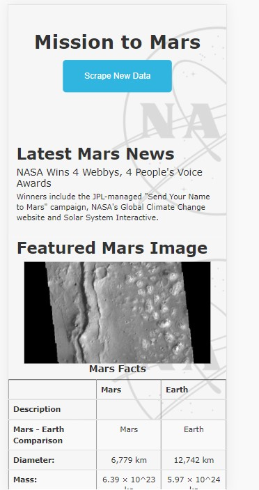

# Mars new web scrapping

## Overview
We will assist a Jr. Data Scientist build a web application about the mission to Mars. 
The website will scrape and display the most recent news. 

The tools used will be:

* ChromeDeveloperTools to identify HTML components attached in the data we want 
* BeautifulSoup and Splinter to automate the web browser and gather the data identified 
* MongoDB will be used to store the data 
* Flask to display the web application 
* HTML, CSS and Bootstrap to style the web application  

Three things were needed to scrape in order to build the web page: 
1. The latest news about Mars
2. The latest features image
3. A table with Mars facts

To accomplish these task different functions were created, the information needed was stored in MongoDB and finally a program with flask was created to call these functions when the user
press the "Scrape New Data" button to display the most recent news and images.

## Results

## Summary

The website displays correctly, it's resposive for dekstop and mobile devices, the "Scrape New Data" button works correctly and boostrap elements were added to format the page. 

